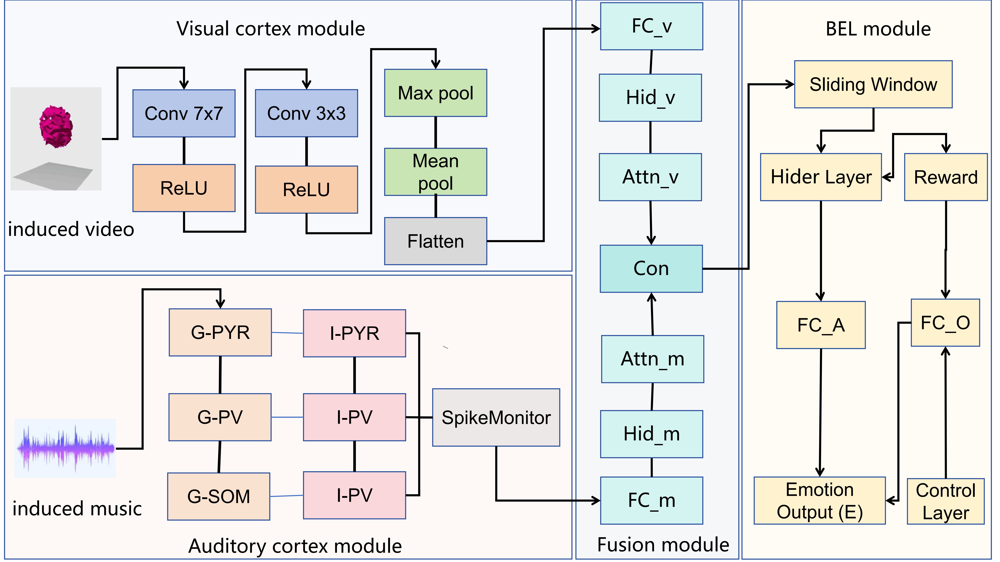

# emotion，brain-like-emotion-code




Our work introduces a novel framework called AVF-BEL (Audiovisual Fusion Brain-like Emotional Learning), which achieves lightweight and interpretable emotional learning and generation through neuroanatomical alignment. The framework integrates key neural structures, including the visual and auditory pathways and emotional circuits, to simulate the brain’s process of audiovisual information fusion and emotional interaction, specifically the amygdala and prefrontal cortex. The AVF-BEL model incorporates modules for visual and auditory processing, audiovisual fusion, and emotional learning, leveraging an improved CORnet-Z model for visual features, a simplified auditory cortex model, and a multi-layer perceptron (MLP) for fusion. It also introduces the Emotional Positivity Parameter (EPP), which reflects emotional positivity through a weighted average and normalization process. The model, evaluated on an audiovisual emotional dataset, demonstrates strong performance with a reduced computational cost, making it suitable for resource-constrained environments. By aligning with biological mechanisms, the AVF-BEL model enhances the interpretability of emotional generation, offering a transparent understanding of the decision-making process, thus improving both emotional accuracy and system explainability.

### Environment Setup

Python version: 3.8

Cuda version: 11.6

Required packages: [requirements.txt](https://github.com/OpenHUTB/emotion/blob/main/requirements.txt)

* Set up the conda environment for the experiments:

```shell
conda create --name emotion python=3.8
conda activate emotion
```

* Download dataset from [link](https://openneuro.org/datasets/ds003715/versions/1.0.0/metadata) and the emotion repository in your root directory:
```shell
cd $ROOTDIR
git clone https://github.com/OpenHUTB/emotion.git
```

* Install the required packages:
```shell
conda install --file requirements.txt
```

* Entering the [source code directory](https://github.com/OpenHUTB/emotion/tree/main/src) and run these python scripts:
```shell
cd src
python BEL_music.py
```

### License
The code is released under a CC-BY-NC 4.0 license, which only allows personal and research use.
For a commercial license, please contact the authors. Portions of source code taken from external sources
are annotated with links to original files and their corresponding licenses.


